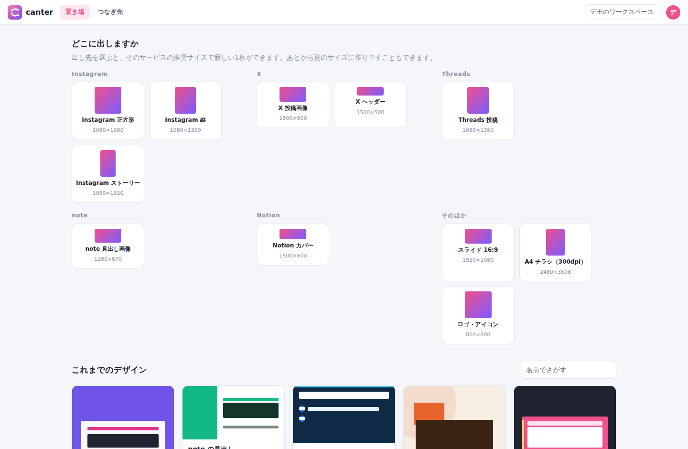
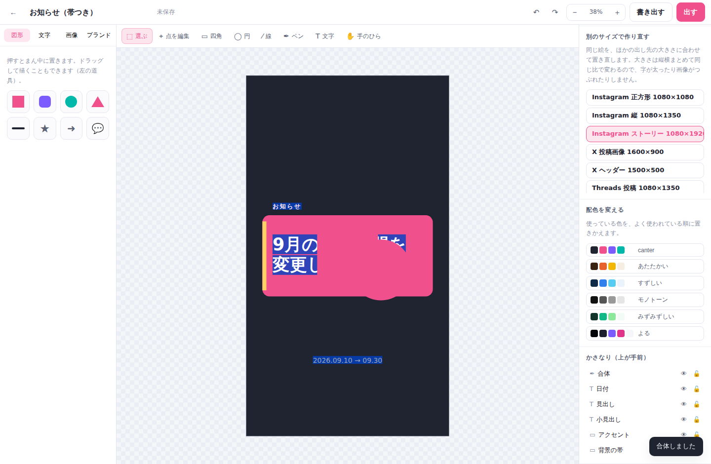
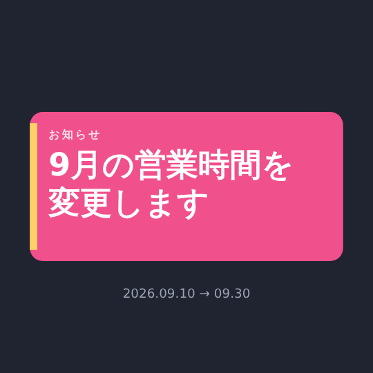
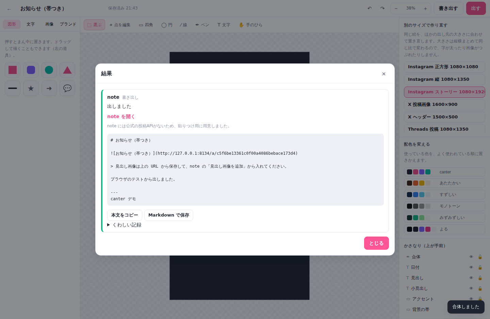
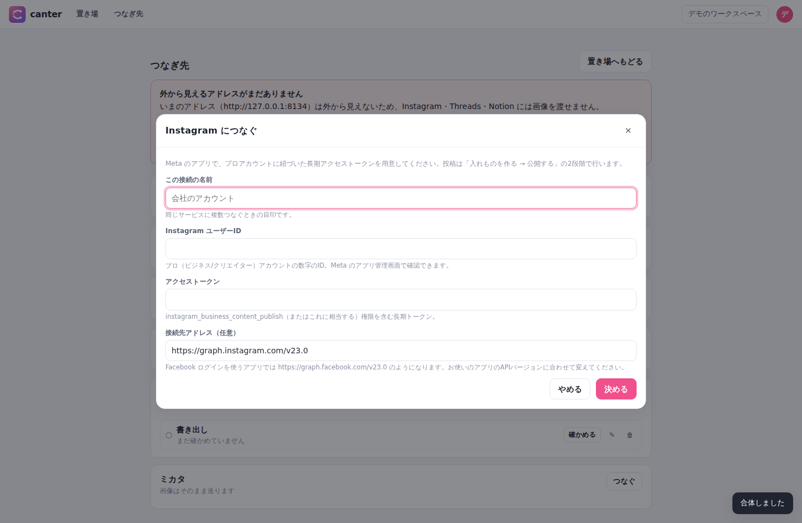

# canter ― つくって、そのまま出す

**イラストレーターのように正確に作れて**、**キャンバのように気軽に始められる**デザイン道具です。
できあがったものは、画面を離れずに **Instagram・X・Threads・Notion・note・ミカタ** へ送れます。

名前の由来は **canvas**（描くところ）と **canter**（馬のはやあし）。
全力疾走ではなく、続けられる速さで進む、という意味をこめています。

- **サーバーは PHP、保存は SQLite、画面は素の JavaScript。** 外部ライブラリもビルド工程もありません。
- **絵はぜんぶ SVG。** 拡大しても輪郭がぼけません。画面に出すのも書き出すのも同じ関数なので、
  「見えているものと違うものが出る」が起きません。
- **1コマンドで起動。** `bin/serve` だけで、デモデータ入りの状態から試せます。

---

## 使い方

```bash
cd canter
bin/serve                 # → http://localhost:8090
```

初回はデモデータ（テンプレートから作った5枚）が自動で入ります。

```
デモ用ログイン:  demo / demo1234
```

必要なもの: **PHP 8.1 以上**（`pdo_sqlite` と `gd` が有効なこと）。それ以外は不要です。



```bash
make serve   # 起動
make fresh   # データを消してデモデータを入れ直す
make test    # テスト（サーバー側 112件 ＋ エディタ 205件）
make browser # ブラウザでの動作確認（Playwright が入っていれば）
make lint    # PHP と JavaScript の構文チェック
```

---

## 何ができるか

| 画面 | できること |
|---|---|
| **置き場** | 出し先（Instagram 正方形・X 投稿画像・note 見出し…）を選ぶと、その推奨サイズで1枚できる。作ったものの一覧もここ |
| **編集** | 図形・文字・画像・パス。整列、パスファインダー、レイヤー、グループ、元に戻す。左に素材、右に設定 |
| **出す** | 書き出した1枚を、選んだ出し先へまとめて送る。時間を決めて予約もできる |
| **つなぎ先** | サービスごとの接続設定と、出した記録（何が起きたかの記録つき） |



### イラストレーターから持ってきたもの

- **ベジェのパス** … ペンツールで描き、点と手（ハンドル）をあとから動かせます（`A` キー）
- **パスファインダー** … 合体・型抜き・交差・中マド。穴のあいた形もそのまま作れます
- **整列と分布** … 2つ以上えらべばその中で、1つだけならキャンバスにそろえます
- **スマートガイド** … 動かしている図形の端・中心が、ほかの図形やキャンバスの中心に近づくと吸いつきます
- **正確な数値入力** … 位置・大きさ・角度・不透明度をすべて数で指定できます

### キャンバから持ってきたもの

- **テンプレート** … 白紙から始めさせません。出し先を選ぶところから始まります
- **ブランドキット** … 色と書体を決めておくと、どのテンプレートでも同じ調子になります
- **配色をまとめて変える** … 使われている色を数え上げ、多い順に見本の色へ置きかえます
- **文字のひな型** … 「見出し」「本文」を押すだけで、書体・大きさ・行間・字間がそろいます
- **マジックリサイズ** … 同じ絵を、別の出し先の大きさで作り直します

書き出すと、こうなります（左のテンプレートから、文字を入れ替えただけのもの）。



### マジックリサイズが何をしているか

Instagram の正方形で作ったものを、そのままストーリー（縦長）にも出したい、という場面のためのものです。

```
1080×1080 で作ったもの   →   1080×1920 にする
```

このとき、次の3つを守ります。

1. **大きさは縦横まとめて同じ比で変える。** 縦だけ引きのばすと、丸が卵になり、字が太ります。
2. **置き場所は、キャンバスの中での相対的な位置を保つ。** 下寄せだったものは、やはり下寄せになります。
3. **キャンバス全体をおおっている図形（背景）だけは、新しい枠にぴったり合わせ直す。**
   ここを例外にしないと、背景に白いすきまができます。

`src/../public/assets/js/editor/scene.js` の `magicResize()` がこれをやっています。
テスト（`tests/editor.mjs`）では「比が変わっていないこと」「背景が枠いっぱいであること」
「文字の大きさも同じ比で変わること」を数で確かめています。

---

## 外のサービスとつなぐ



つなぎ先は6つです。**それぞれ事情がちがう**ので、正直に書いておきます。

| 出し先 | どうやって出すか | 手元（localhost）で動かしたまま出せるか |
|---|---|---|
| **Instagram** | 画像の**URL**を渡し、Instagram 側が取りに来る | **出せません**（外から見えるアドレスが必要） |
| **Threads** | 同上。文字だけの投稿なら URL は不要 | 文字だけなら出せます／画像つきは不可 |
| **X** | 画像を**そのまま**送る | **出せます** |
| **Notion** | カバーと本文の画像を**URL**で渡す | 文字だけなら出せます／画像つきは不可 |
| **note** | **公式APIが無いため、貼りつけ用に書き出す** | 出せます（貼るのは人） |
| **ミカタ** | 制作タスクを立てる／チャンネルに流す | **出せます** |

### いちばんつまずくところ ― 画像の渡し方

Instagram・Threads・Notion は「画像そのもの」ではなく「**画像の URL**」を受け取る作りです。
相手のサーバーがその URL に取りに来るので、canter が
**インターネットから見える場所に置かれていないと投稿できません**。
手元の PC で動かしているあいだは、どうやっても通りません（アドレスが `localhost` だからです）。

外に置いたら、環境変数に外から見えるアドレスを入れてください。

```bash
CANTER_PUBLIC_URL=https://canter.example.com
```

画面の「つなぎ先」には、いまのアドレスで届くかどうかが出ます。
届かない状態で出そうとしたときも、送る前に理由を出して止めます。

一方 **X とミカタは画像そのものを送る**ので、社内 PC で動かしたままでも出せます。

### note について

note には、外部のプログラムから記事を投稿するための**公式な API が公開されていません**。
ブラウザの内部通信を真似する方法（いわゆる非公式 API）は世の中にありますが、

- note 側の都合でいつ変わってもおかしくない（実際たびたび変わっています）
- 利用規約の面でも、人に勧められるものではない

ため、canter では**やりません**。かわりに、note の編集画面に貼るだけの形にして渡します。

- 見出し画像は書き出した PNG（URL つき）
- 本文は Markdown を、1回のコピーで持っていける形で

「自動で投稿されない」という一手間は残りますが、
ある日とつぜん動かなくなる連携や、規約に触れるかもしれない連携よりはましだと考えています。
note が公式の API を出したら、`src/Connector/Note.php` を差し替えるだけで済むようにしてあります。

### ミカタとつなぐ

同じリポジトリにある[ミカタ](../mikata/README.md)（チームと個人のタスクを1枚で見るアプリ）につなげます。
デザインが1枚できたときに、

- **制作タスクを立てる**（予約の日付をそのまま納期にします）
- **チャンネルに1行流す**

のどちらか、または両方を行います。「作って終わり」にせず、
誰がいつ確認するのかまでつなげるためのものです。

```
canter で「9月のお知らせ」を書き出す
   ↓
ミカタに タスク #33「9月のお知らせ画像」（納期 9/10）ができる
チャンネルに「デザインができました：9月のお知らせ画像」が流れる
```

ミカタのアドレス・ログインID・パスワードを入れるだけでつながります。
つないだ直後に実際にログインして、チームとプロジェクトが読めるかまで確かめます。



### 接続に何を入れるか

サービスごとの入力欄は、サーバー側（`src/Connector/*.php` の `fields()`）が
そのまま画面に渡しています。あとからサービスを足しても、画面を直す必要はありません。

| 出し先 | 入れるもの |
|---|---|
| Instagram | Instagram ユーザーID、アクセストークン、接続先アドレス（APIバージョン） |
| X | アクセストークン、リフレッシュトークン（任意）、クライアントID/シークレット（任意） |
| Threads | Threads ユーザーID、アクセストークン |
| Notion | インテグレーションのシークレット、置き場所の種類とID、Notion-Version |
| note | 書き手の名前（任意）、note のURL（任意） |
| ミカタ | ミカタのアドレス、ログインID、パスワード、何をするか |

**API のバージョンは入力できるようにしてあります。**
Meta も Notion も、バージョンは定期的に入れ替わります。
canter の側で決め打ちにすると、ある日とつぜん動かなくなるので、
使っているアプリの設定に合わせて変えられるようにしました。

トークンとパスワードは **AES-256-GCM で暗号化**して保存し、画面には返しません
（「入っているかどうか」だけを返します）。鍵は `CANTER_SECRET` か `data/secret.key` です。

### 予約投稿

時間を決めて出すこともできます。実行のきっかけは2つあります。

1. **画面を開いている人がいるとき** … 1分おきにサーバーへ「時間の来たものはある？」と聞きます
2. **誰も開いていない時間帯にも出したいとき** … `bin/tick` を cron に入れます

```cron
*  *  *  *  *  cd /path/to/canter && bin/tick >> data/tick.log 2>&1
```

常駐の仕組み（ワーカー）を持たないので、置き場所を選びません。
二重に走っても、送る直前に「送信中」の印を立てるので、同じものが2回出ることはありません。

---

## 中身の組み立て

```
canter/
├── bin/serve            起動（これだけ叩けば動く）
├── bin/seed             デモデータを入れる
├── bin/tick             時間の来た予約を送る（cron 用）
├── bin/start            コンテナの中での起動（Docker / Render 用）
├── src/                 サーバー側（PHP）
│   ├── Db.php           SQLite の接続とテーブル作成
│   ├── Auth.php         ログイン
│   ├── Workspaces.php   ワークスペース・メンバー・ブランドキット
│   ├── Designs.php      デザインの出し入れと履歴
│   ├── Doc.php          ★ デザインの中身の検査（受け取ってよい形だけを通す）
│   ├── Assets.php       画像の保管と配信（/a/{token}）
│   ├── Templates.php    サイズのプリセットとテンプレート
│   ├── Secret.php       トークンの暗号化
│   ├── Http.php         外部への通信（curl はここだけ）
│   ├── Connections.php  つなぎ先の出し入れ
│   ├── Publish.php      投稿・予約・記録
│   ├── Connector/       ★ サービスごとの違いはここに閉じこめる
│   │   ├── Connector.php  決まりごと（fields / verify / publish の3つ）
│   │   ├── Instagram.php  Threads.php  XCom.php
│   │   ├── Notion.php     Note.php     Mikata.php
│   ├── Api.php          JSON API の入口と権限チェック
│   └── Seed.php         デモデータ
├── public/
│   ├── index.php        入口（/api/… は API、/a/… は画像、それ以外は画面のガワ）
│   └── assets/js/
│       ├── app.js       画面の切りかえ
│       ├── store.js     持っているデータと、その出し入れ
│       ├── api.js       サーバーとのやりとり（fetch はここだけ）
│       ├── editor/      ★ エディタの中身
│       │   ├── geom.js      位置・大きさ・回転・ベジェの計算
│       │   ├── pathops.js   パスファインダー（Greiner–Hormann）
│       │   ├── scene.js     図形の作り方と組みかえ・マジックリサイズ
│       │   ├── render.js    doc → SVG（画面も書き出しもここを通る）
│       │   ├── canvas.js    えらぶ・動かす・変形する・描く
│       │   ├── snap.js      スマートガイド
│       │   ├── history.js   元に戻す・やり直す
│       │   └── exporter.js  PNG / SVG の書き出し
│       └── views/       画面ごと（置き場 / 編集 / 設定パネル / 出す / つなぎ先 / ログイン）
├── tests/run.php        サーバー側のテスト
├── tests/editor.mjs     エディタの計算のテスト
└── tests/browser.mjs    ブラウザでの動作確認
```

### データの持ち方

すべて `data/canter.sqlite` に入ります。画像の実体だけは `data/uploads/` に置きます。
バックアップは `data/` をまるごとコピーするだけです。

| テーブル | 中身 |
|---|---|
| `users` / `sessions` | ログインする人とログイン状態 |
| `workspaces` / `members` | いっしょに作る人のまとまり |
| `brands` | ブランドキット（色・書体） |
| `designs` / `versions` | デザイン1枚と、その履歴 |
| `assets` | 画像（取りこんだ素材と、書き出した PNG） |
| `connections` | つなぎ先（トークンは暗号化して1列に） |
| `posts` / `post_logs` | 出した1件と、そこで何が起きたか |

### デザインの中身（doc）

図形ごとにテーブルを分けず、1枚まるごとを JSON で持ちます。読み書きが必ず「1枚単位」だからです。

```json
{
  "v": 1, "w": 1080, "h": 1080, "bg": "#ffffff",
  "nodes": [
    { "id": "n1", "type": "rect", "x": 86, "y": 324, "w": 907, "h": 432,
      "rot": 0, "opacity": 1, "fill": "#f0508c", "radius": 38 }
  ]
}
```

どの図形も「置き場所（x, y, w, h, rot）」を同じ形で持ちます。
中の形は種類ごとに違いますが、**パスだけは 0〜1 に正規化して**持ちます。
こうしておくと、大きさを変えたときに形が自動でついてきます。

サーバー側でも `src/Doc.php` が同じ形かどうかを検査します。
知らない項目は落とし、読めない色は既定に戻し、図形の数と入れ子の深さに上限をつけます。
画面の不具合や古い版が壊れたものを送ってきても、保存の時点で止まります。

---

## なぜこの形にしたのか

### 画面に出すものと、書き出すものを同じにする

デザイン道具でいちばん困るのは「画面で見たものと、書き出したものが違う」ことです。
canter では `render.js` の `renderDoc()` ただ1つが SVG を組み立て、

- 編集画面は、その結果をそのまま置く
- 書き出しは、その結果を文字列にして PNG に焼く

という形にしました。作りかたが1つしかないので、ずれようがありません。

書き出しのとき画像を `data:` に埋めこんでいるのは、
ブラウザが `` に読ませた SVG の中から外のファイルを取りに行かないためです。
文字は端末に入っているフォントで描かれます（Webフォントは読みこまれません）。
canter が最初から用意している書体を、どの端末にもある系統から選んでいるのはこのためです。

### サービスごとの違いを1か所に閉じこめる

出し先は6つあり、認証も、画像の渡し方も、投稿の手順もばらばらです。
これを画面や投稿処理に散らすと、1つ足すたびにあちこち直すことになります。

そこで `src/Connector/` に、3つの決まりごとだけを置きました。

```php
fields()   // 接続に何を入れてもらうか  → 画面はこれを見てフォームを作る
verify()   // 本当につながるか
publish()  // 1件出す
```

サービスを足すときに触るのは、このフォルダと `Connections::SERVICES` の1行だけです。
画面（`views/connections.js`）は何も知らなくてよくなります。

### パスファインダーを、目で確かめない

「合体」「型抜き」が正しいかどうかは、見た目では分かりません。
ほんの少しずれていても、拡大するまで気づけないからです。

そこでテストでは、**まったく別のやり方で出した答え**と突き合わせています。
細かい格子（220×220）を敷いて、1マスずつ「A の中か」「B の中か」を数え、
そこから求めた面積を正解とします。
アルゴリズム（Greiner–Hormann）とはやり方が違うので、両方が同じ間違いをすることはありません。

決め打ちの10通り（重なる四角・辺が接する四角・角だけ接する四角・穴のあく形・回した形…）と、
乱数で作った25通りの形について、4つの演算すべてを確かめています（合計140通り）。
誤差はどれも 1% 未満です。

端どうしがぴったり重なっている形は、この手順では解けません。
そのときは片方をごくわずか（大きさの1000万分の1）動かして計算し直します。
見た目には分からない大きさですが、これで解けるようになります。

### 権限の書き忘れが起きない形にする

ワークスペースに属するデータは、すべて `/api/workspaces/{id}/...` の下に置き、
入口の1か所（`Api::workspaces()`）で必ずメンバーかどうかを確かめます。
個々の処理で書き忘れても、そこまで届きません。

画像も同じで、デザインに置けるのは自分のワークスペースの画像だけです
（保存のたびに `Doc::usedAssets()` が中身を見て確かめます）。

---

## 安全のこと

小さなチームの中で使う前提の、軽い作りにしています。

- パスワードは `password_hash()` で保存し、生の文字列はどこにも残りません。
- ログイン状態は推測できない64桁のトークンで、**HttpOnly / SameSite=Lax** の Cookie に入れます。
- 外部サービスのトークンは **AES-256-GCM** で暗号化して保存し、画面には返しません。
- SQL はすべてプレースホルダ（`?`）を使います。
- 画面の文字は `textContent` で入れます（`innerHTML` は使っていません）。
- 取りこめる画像は PNG・JPEG・WebP・GIF だけです。**SVG は受け付けません**
  （中に script を書けてしまうため）。自己申告の種類ではなく、中身を見て判定します。
- 更新系の通信には独自ヘッダ（`X-Canter`）を要求するので、他のサイトから勝手に操作されません。

**画像の配信（`/a/{token}`）だけはログイン不要です。**
Instagram などが取りに来られないと投稿できないためです。
そのぶん token は32桁のランダムな文字列にしてあります。
**人に見せたくないものを扱う場合は、この性質を承知したうえでお使いください。**

インターネットに公開するなら、必ず HTTPS の後ろに置いてください。

---

## テスト

```bash
make test      # サーバー側 ＋ エディタ
make browser   # ブラウザでの動作確認（任意）
```

**サーバー側（`tests/run.php`・112件）**
外に出ていく通信はしません。相手のサービスが止まっているとこちらまで落ちるからです。かわりに
「おかしなものを正しくはじけるか」「権限のないデータに手が届かないか」「合言葉が漏れないか」を見ます。

- 壊れた doc（知らない種類・読めない色・無限大・深すぎる入れ子・多すぎる図形）をはじけるか
- ほかのワークスペースのデザイン・画像・接続・投稿に手が届かないこと
- パスワードを空で送っても、前の値が消えないこと
- 暗号化したものが、1文字変えるだけで読めなくなること
- 履歴が「続けて保存したときは増えず、人や時間が変わると増える」こと
- 予約が、時間が来るまで送られないこと・二度送られないこと
- 用意したテンプレート17枚すべてが、検査を通ること

ミカタとのやりとりだけは、動いているミカタがあるときに限って本当に試します。

```bash
CANTER_MIKATA_URL=http://127.0.0.1:8080 \
CANTER_MIKATA_LOGIN=demo CANTER_MIKATA_PASSWORD=demo1234 php tests/run.php
```

**エディタ（`tests/editor.mjs`・205件）**
画面を出さずに確かめられる計算部分です。回転を含めた囲み、座標の行き来、
パスファインダー（格子との突き合わせ140通り）、マジックリサイズ、グループ、整列、
配色の置きかえ、元に戻す、吸着。

**ブラウザ（`tests/browser.mjs`）**
実際に Chromium で開いて、ログイン → テンプレートから作る → 図形を足す → ドラッグで動かす →
元に戻す → 合体 → 別のサイズで作り直す → PNG に書き出す → 自動保存 → note へ書き出す、
までを通します。画面でエラーが出ていないことも見ます。

---

## インターネットに置く

### Render（Docker）

リポジトリ直下の `render.yaml` に `canter` サービスを用意してあります。
Render の **New → Blueprint** でこのリポジトリを選び、Blueprint Name を入れて Apply するだけです。

置いたあと、**`CANTER_PUBLIC_URL` に払い出されたアドレスを入れてください**。
これを入れないと、Instagram・Threads・Notion に画像を渡せません。

```
CANTER_PUBLIC_URL = https://canter.onrender.com
CANTER_SECRET     = （長いランダムな文字列。トークンの暗号化に使います）
```

**無料プランではディスクが使えません。** 眠って起き直すとデータが消えます（お試し用）。
そのままだと誰もログインできなくなるので、無料プランでは `CANTER_SEED=1` を渡しています。
**中身が空のときだけ**デモデータを入れる、というものです。

データを残して業務で使う場合は、`render.yaml` の `canter` サービスで

1. `plan: free` を `plan: starter` に変える（有料。月7ドル程度）
2. コメントアウトしてある `disk:` の4行を有効にする
3. `CANTER_SEED` の2行を消す
4. `CANTER_SECRET` に自分で決めた長い文字列を入れる（**入れないと、再起動のたびに接続設定が読めなくなります**）

の4つを行ってください。

### 自前のサーバー / 社内 PC

```bash
docker compose up -d      # → http://localhost:8090
```

または PHP が入っているマシンで `bin/serve` を動かし続けるだけでも使えます。
同じ Wi-Fi のスマホからは、起動時に表示される `http://192.168.x.x:8090` で開けます。

---

## これから足せること

いまは入っていないが、この作りのまま足せるものです。

- **画像の複数枚投稿（カルーセル）** … Instagram は入れものを複数作って束ねる形なので、
  `Instagram::publish()` に段を1つ足せば入ります
- **動画・リール** … 同じ2段階の手順です（取りこみ待ちの時間が長くなります）
- **OAuth の画面** … いまはトークンを手で貼る形。認可画面を通す流れを `Connections` に足せます
- **クリッピングマスク**、**テキストのアウトライン化**（`pathops.js` の輪郭化を文字にも使う）
- **他の人と同時に編集**（`versions` があるので、そこを起点にできます）
- **PDF での書き出し**（いまは PNG と SVG）
