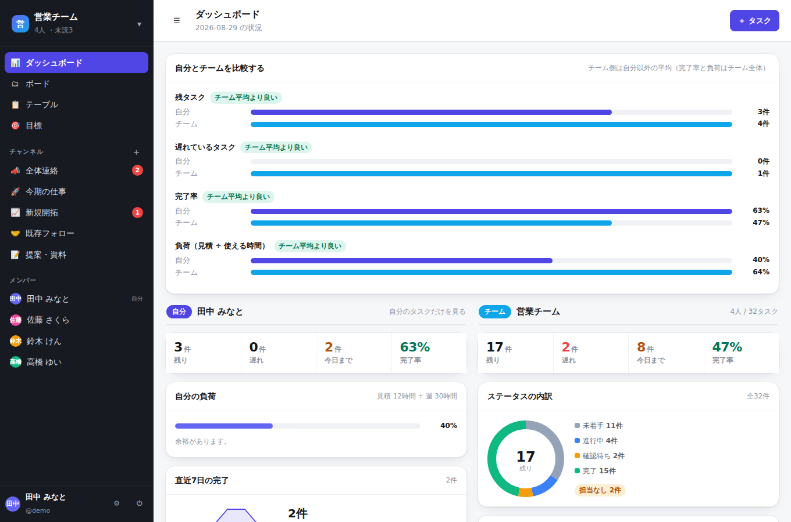
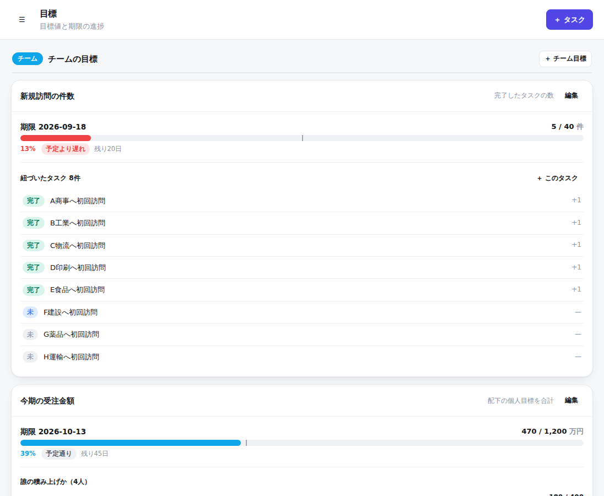
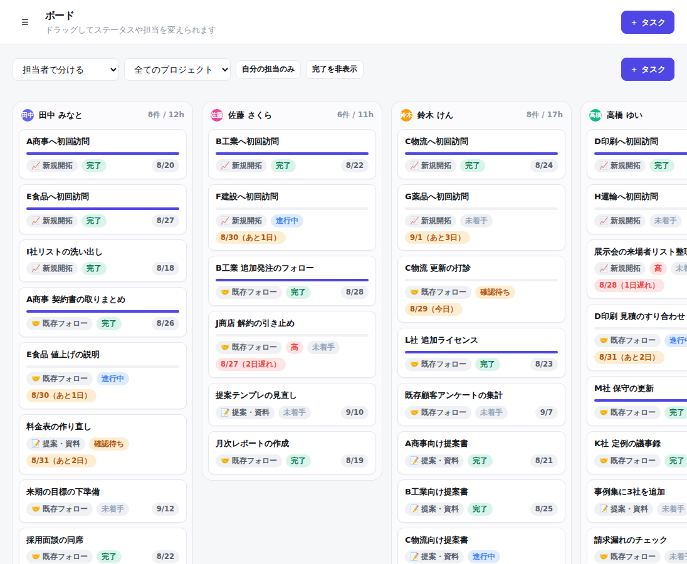

# ミカタ ― チームと個人のタスクを1枚で

**Notion のようなタスク管理**と、**Slack のような会話**をひとつにしたチーム向けアプリです。
「誰が・何を・いつまでに・どこまで」を、個人とチームの両方から同じ物差しで見えるようにします。

名前の由来は **見方**（見えるようにする）と **味方**（チームの味方になる）。



- **サーバーは PHP、保存は SQLite、画面は素の JavaScript。** 外部ライブラリもビルド工程もありません。
- **グラフは自前の SVG。** Chart.js のような読み込みが無いので、社内ネットワークでもそのまま動きます。
- **1コマンドで起動。** `bin/serve` だけで、デモデータ入りの状態から試せます。

---

## 使い方

```bash
cd mikata
bin/serve                 # → http://localhost:8080
```

初回はデモデータ（4人・32タスク・5目標）が自動で入ります。

```
デモ用ログイン:  demo / demo1234
他のメンバー  :  sakura / ken / yui（パスワードは同じ）
```

必要なもの: **PHP 8.1 以上**（`pdo_sqlite` が有効なこと）。それ以外は不要です。

```bash
make serve   # 起動
make fresh   # データを消してデモデータを入れ直す
make test    # テスト（102件）
make lint    # PHP と JavaScript の構文チェック
```

---

## 何ができるか

| 画面 | できること |
|---|---|
| **ダッシュボード** | 左に「自分」、右に「チーム」を同じ並びで表示。残タスク・遅延・完了率・負荷・目標の進捗を1枚で見る |
| **ボード** | カンバン。ドラッグでステータスを変更。**担当者ごとの列**にも切り替えられる |
| **テーブル** | Notion のデータベース表示にあたるもの。検索・絞り込み・並べ替え |
| **目標** | 目標値と期限の進捗。チーム目標と個人目標を同じゲージで並べる |
| **チャンネル** | Slack のような会話。タスクのスレッドも同じ流れに出る |
| **チーム設定** | 参加コード・メンバーの「1週間に使える時間」・プロジェクトの管理 |

---

## 画面の読み方

数字の意味はこの4つだけ覚えれば全部読めます。

| 言葉 | 意味 |
|---|---|
| **残り** | 完了していないタスク |
| **遅れ** | 納期が今日より前で、まだ完了していないタスク |
| **負荷** | 残タスクの見積工数 ÷ その人が1週間に使える時間 |
| **進捗** | 実績値 ÷ 目標値 |

### 「自分」と「チーム」を並べる



ダッシュボードは左右に割れていて、**左が自分、右がチーム**です。
上の帯では、自分の数字がチーム平均と比べてどうかを4項目で出します。
「自分は進んでいるつもりだったが、チームでは重いほうだった」に気づけるようにするためです。

大事なのは、この2つが**同じ関数で計算されている**こと（`src/Metrics.php` の `personSummary()`）。
自分の欄とチームのメンバー一覧はまったく同じ数え方なので、見比べたときに必ず筋が通ります。

### 目標のゲージにある縦線

目標の帯にある細い縦線は「**期限までの日数から見て、いま何％まで進んでいるべきか**」です。

- 塗りが線より**右** → 予定より早い
- 塗りが線より**左** → 予定より遅れ（赤くなります）

「40% 終わった」だけでは早いのか遅いのか分かりません。期限と並べて初めて意味が出ます。

### チームの目標は、誰の積み上げでできているのか

チーム目標には **配下の個人目標を合計** という数え方があります。

```
今期の受注金額  1,200万円（チーム）
  ├ 田中  400万円
  ├ 佐藤  350万円
  ├ 鈴木  250万円
  └ 高橋  200万円
```

こうしておくと、チームの数字と個人の数字が別々に管理されることがなくなります。
チームのゲージの下には、誰がどれだけ積んだかがそのまま並びます。

### 担当者ごとのボード



ボードは「ステータスで分ける」と「**担当者で分ける**」を切り替えられます。
担当者で分けると、誰にいくつ乗っているかが列の高さになって出るので、
偏りが目で分かります（列の見出しに件数と見積時間も出ます）。

---

## なぜこの形にしたのか

### プロジェクト＝データベース＝チャンネル

このアプリの中心にある考えです。

```
        プロジェクト「新規開拓」
        ├─ タスク一覧（Notion のデータベース）
        └─ 会話          （Slack のチャンネル）
```

Notion と Slack を別々に使っていると、「タスクの場所」と「その話をした場所」が離れます。
そこで**同じ入れ物**にしました。プロジェクトを1つ作れば、タスク置き場とチャンネルが同時にできます。

### タスクを動かすと、それが会話に流れる

ステータス・担当・納期・実績を変えると、その内容が**自動でタスクのスレッドに1行流れます**。

```
田中 みなと  10:12
  ステータスを「未着手」→「進行中」に変えました
田中 みなと  15:40
  担当を 佐藤 さくら さんにしました / 納期を 2026-09-04 にしました
```

チャンネルにも小さく顔を出すので、**「変更した」→「報告する」の二度手間がなくなります**。
report のための report を書かなくてよくする、というのがこの設計のねらいです。

### タスクは「時間」と「数字」を両方持つ

1つのタスクが次の2組を持ちます。

- **納期（due_date）と見積工数（estimate_h）** … スケジュールの材料
- **目標値（target_value）と実績値（actual_value）** … 数字の材料

前者から「負荷」と「遅れ」が、後者から「目標の進捗」が出ます。
どちらか片方だけだと、「忙しいが数字は出ていない」「数字は出ているが破綻寸前」が見えません。

---

## 中身の組み立て

```
mikata/
├── bin/serve            起動（これだけ叩けば動く）
├── bin/seed             デモデータを入れる
├── src/                 サーバー側（PHP）
│   ├── Db.php           SQLite の接続とテーブル作成
│   ├── Auth.php         ログイン（パスワードは password_hash で保存）
│   ├── Teams.php        チーム・メンバー・プロジェクト
│   ├── Tasks.php        タスク（変更をスレッドに流すのもここ）
│   ├── Goals.php        目標（達成率と「予定より早い/遅い」の計算）
│   ├── Chat.php         会話・未読・メンション
│   ├── Metrics.php      ★ 可視化のための集計（グラフはこの結果を描くだけ）
│   ├── Api.php          JSON API の入口と権限チェック
│   └── Seed.php         デモデータ
├── public/
│   ├── index.php        入口（/api/… は API、それ以外は画面のガワ）
│   └── assets/js/
│       ├── app.js       サイドバー・上の帯・画面の切り替え
│       ├── store.js     持っているデータと、その出し入れ
│       ├── charts.js    SVG のグラフ（ドーナツ・棒・ゲージ・折れ線）
│       ├── taskpanel.js タスクの詳細（プロパティ＋スレッド）
│       └── views/       画面ごと（ダッシュボード / ボード / テーブル / 目標 / チャンネル / チーム / ログイン）
└── tests/run.php        テスト
```

### データの持ち方

すべて `data/mikata.sqlite` の1ファイルに入ります。バックアップはこのファイルをコピーするだけです。

| テーブル | 中身 |
|---|---|
| `users` / `sessions` | ログインする人とログイン状態 |
| `teams` / `members` | チームと、その人の役割・1週間に使える時間 |
| `projects` | プロジェクト（＝チャンネル） |
| `tasks` | タスク（納期・見積・目標値・実績値・紐づけた目標） |
| `goals` | 目標（目標値・期限・数え方・親子関係） |
| `messages` | 会話（`task_id` があればタスクのスレッドの発言） |
| `reads` | どこまで読んだか |

### 通信の作り

- 画面を開いたときに `/api/teams/{id}/bootstrap` を**1回だけ**呼び、必要なものを全部受け取ります。
- そのあとは5秒おきに `/api/teams/{id}/sync?since=…` で**新着の差分だけ**を取りに行きます。
  WebSocket を使わないので、置き場所を選びません。
- タスクを書き換えたときは、先に画面を動かしてからサーバーの答えで上書きします（失敗したら元に戻します）。

---

## 安全のこと

小さなチームの中で使う前提の、軽い作りにしています。

- パスワードは `password_hash()` で保存し、生の文字列はどこにも残りません。
- ログイン状態は推測できない64桁のトークンで、**HttpOnly / SameSite=Lax** の Cookie に入れます。
- SQL はすべてプレースホルダ（`?`）を使うので、SQL インジェクションは起きません。
- 画面の文字は `textContent` で入れます（`innerHTML` は使っていません）。
  他人が書いたメッセージが HTML として動くことはありません。
- チームに属するデータは、入口の1か所（`Api::teams()`）で**必ず**メンバーかどうかを確かめます。
- 更新系の通信には独自ヘッダ（`X-Mikata`）を要求するので、他のサイトから勝手に操作されません。

**インターネットに公開するなら**、必ず HTTPS の後ろに置いてください。
Cookie の `secure` 属性は HTTPS のときだけ自動で付きます。

---

## テスト

```bash
make test
```

画面のない部分（数え方・権限・自動投稿）を **102件** で確かめています。
可視化の数字がずれても目で気づきにくいので、集計はとくに細かく見ています。

- 納期の分け方（遅延／今日／3日以内／それ以降／なし）と、境目の日
- 完了率・負荷（未完了の見積だけを数えているか、使える時間が0のとき落ちないか）
- 目標の3+1通りの数え方と、親子の積み上げ、目標値が0のときの割り算
- 「予定より早い/遅い」の判定と残り日数
- チーム外の人が見られない・担当にできないこと
- ステータスを変えるとスレッドに1行流れ、メモだけの変更では流れないこと
- 未読とメンションの数え方

---

## インターネットに置く

### Render（Docker）

リポジトリ直下の `render.yaml` に `mikata` サービスを用意してあります。
Render の **New → Blueprint** でこのリポジトリを選ぶだけです。
`/app/data` にディスクを付けているので、再起動してもタスクと会話は消えません。

### 自前のサーバー / 社内 PC

```bash
docker compose up -d      # → http://localhost:8080
```

または PHP が入っているマシンで `bin/serve` を動かし続けるだけでも使えます。
同じ Wi-Fi のスマホからは、起動時に表示される `http://192.168.x.x:8080` で開けます。

> 内蔵サーバーは数人〜数十人なら十分ですが、もっと大きくするときは
> nginx + php-fpm に置き換えてください（アプリ側の変更は不要です）。

---

## これから足せること

いまは入っていないが、この作りのまま足せるものです。

- **本物の Notion / Slack との同期** … `Tasks` と `Chat` が入口を1本にまとめてあるので、
  そこに外部への送信を足すだけで済みます。
- **繰り返しタスク**、**サブタスク**（`tasks` に `parent_id` を足す）
- **ファイル添付**（`messages` に添付テーブルを足す）
- **メール / プッシュ通知**（いまは画面内のトーストと未読バッジのみ）
- **CSV 書き出し**（`Metrics::build()` の結果をそのまま出せます）
